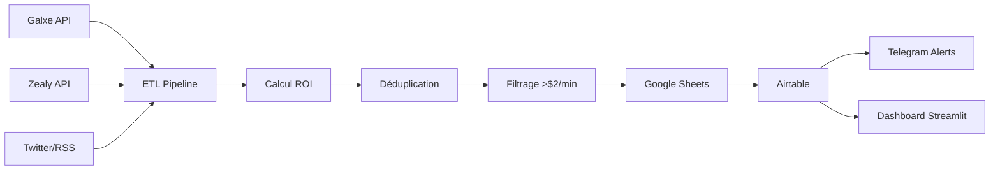

# 🎯 MASTER ROADMAP - Web3 Opportunities Tracker
*Basé sur User_Deepseek_Discuss.txt - Planning Séquentiel Complet*

## 📋 Vue d'ensemble du Projet
**Durée totale** : 23 jours (2h30/jour = 57.5 heures)  
**Objectif** : Automatiser l'extraction de 100% des opportunités Web3 chaque jour  
**Budget mensuel** : $61-76 pour fonctionner en autonomie  
**ROI attendu** : $3k-5k/mois net  

## 🏗️ Architecture Finale Visée
- **Pipeline automatisé** : Scraping → Filtrage → Stockage → Notifications
- **Sources** : Galxe, Zealy, Layer3, Twitter/RSS, airdrops.io
- **Stack** : Python + Docker + Vault + n8n + Airtable + Telegram
- **Monitoring** : Prometheus + Grafana + alertes automatiques

---

## 📅 PLANNING JOUR PAR JOUR

### 🔧 **SEMAINE 1 : Infrastructure & Fondations**

| Jour | Focus | Tâches Principales | Durée | Status |
|------|-------|-------------------|-------|--------|
| **01** | Infrastructure Docker | Setup VPS, Docker, Git, Python venv, Vault | 2h30 | ✅ VALIDÉ |
| **02** | Monitoring | Prometheus, Grafana, benchmarks | 2h30 | ✅ VALIDÉ |
| **03** | Scraper Galxe | API GraphQL, parsing, tests | 2h30 | ✅ VALIDÉ |
| **04** | Scraper Zealy | API REST, normalisation | 2h30 | 🔄 NEXT |
| **05** | Scrapers Secondaires | Twitter/RSS, fallbacks | 2h30 | ⏳ À FAIRE |
| **06** | Processing & ROI | Calcul ROI, déduplication | 2h30 | ⏳ À FAIRE |
| **07** | Stockage | Google Sheets, Airtable | 2h30 | ⏳ À FAIRE |

### 🤖 **SEMAINE 2 : Automatisation & Tests**

| Jour | Focus | Tâches Principales | Durée | Status |
|------|-------|-------------------|-------|--------|
| **08** | n8n Workflows | ETL automatique, webhooks | 2h30 | ⏳ À FAIRE |
| **09** | Dashboard | Streamlit, métriques | 2h30 | ⏳ À FAIRE |
| **10** | Notifications | Telegram Bot, alertes | 2h30 | ⏳ À FAIRE |
| **11** | Healthchecks | Monitoring, failover | 2h30 | ⏳ À FAIRE |
| **12** | Tests Complets | CI/CD, tests d'intégration | 2h30 | ⏳ À FAIRE |
| **13** | Documentation | Guides, API docs | 2h30 | ⏳ À FAIRE |
| **14** | MVP Déploiement | Production, validation | 2h30 | ⏳ À FAIRE |

### 🚀 **SEMAINE 3 : Optimisation & Finalisation**

| Jour | Focus | Tâches Principales | Durée | Status |
|------|-------|-------------------|-------|--------|
| **15** | Cache & Performance | Redis, optimisations | 2h30 | ⏳ À FAIRE |
| **16** | Intelligence IA | NLP, filtrage sémantique | 2h30 | ⏳ À FAIRE |
| **17** | Tests de Charge | 500+ opp/jour, scalabilité | 2h30 | ⏳ À FAIRE |
| **18** | Sécurité | Audit, backup, failover | 2h30 | ⏳ À FAIRE |
| **19** | Formation | Documentation utilisateur | 2h30 | ⏳ À FAIRE |
| **20** | Buffer 1 | Rattrapage, améliorations | 2h30 | ⏳ RÉSERVE |
| **21** | Buffer 2 | Rattrapage, améliorations | 2h30 | ⏳ RÉSERVE |
| **22** | Buffer 3 | Rattrapage, améliorations | 2h30 | ⏳ RÉSERVE |
| **23** | Clôture | Livraison finale, transfert | 2h30 | ⏳ RÉSERVE |

---

## 🎯 Points de Contrôle Critiques

### **Jour 7 : Premier flux complet**
✅ Galxe → Zealy → RSS → Google Sheets → Airtable  
✅ Calcul ROI > $2/min fonctionnel  

### **Jour 14 : MVP opérationnel**
✅ Pipeline complet : extraction → filtrage → notification  
✅ 100+ opportunités/jour automatiquement  
✅ Monitoring et alertes actifs  

### **Jour 23 : Système autonome**
✅ NLP + optimisation ROI automatique  
✅ 6-12 mois de fonctionnement sans maintenance lourde  
✅ Documentation complète pour transfert  

---

## 📊 Métriques de Succès Cumulées

| Jour | Opportunités/jour | Sources actives | Taux filtrage ROI>$2 | Uptime | Gain estimé |
|------|-------------------|-----------------|---------------------|---------|-------------|
| 07   | 50-100           | 3               | 30%                 | 90%     | $75/jour    |
| 14   | 150-200          | 4               | 50%                 | 95%     | $150/jour   |
| 23   | 200+             | 5+              | 60%+                | 99%     | $200+/jour  |

---

## 🛠️ Stack Technologique Final

### **Core**
- **Python 3.8+** : Backend, scrapers, ETL
- **Docker** : Containerisation de tous les services
- **HashiCorp Vault** : Stockage sécurisé des clés API

### **Données**
- **Google Sheets** : Stockage principal collaboratif
- **Airtable** : Base de données avec vues filtradas  
- **Redis** : Cache haute performance

### **Automatisation**
- **n8n** : Orchestration workflows ETL
- **Playwright** : Scraping anti-bot
- **Cron** : Scheduling des tâches

### **Monitoring**
- **Prometheus** : Métriques système
- **Grafana** : Dashboards visuels
- **Telegram Bot** : Notifications temps réel

---

## 🔄 Workflow Final Automatisé

---

## 📈 Évolution Post-MVP (après Jour 23)

### **Mois 1-3 : Optimisation**
- Ajout de nouvelles sources (DeFiLlama, Layer3)
- Amélioration des filtres IA
- Interface utilisateur web

### **Mois 3-6 : Scaling**
- Multi-utilisateurs
- API publique
- Communauté et feedback

### **Mois 6+ : Monétisation**
- Version premium avec plus de sources
- Alertes personnalisées
- Intégration portefeuilles

---

*Ce planning est conçu pour être suivi jour après jour par un agent IA autonome avec toutes les informations contextuelles nécessaires dans chaque fichier quotidien.*
